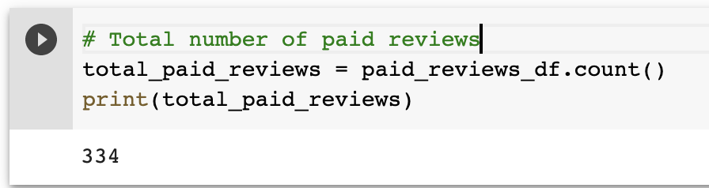
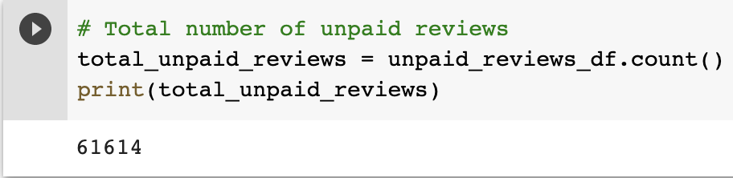
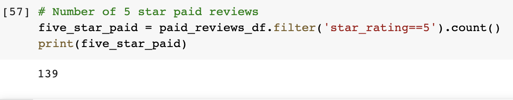
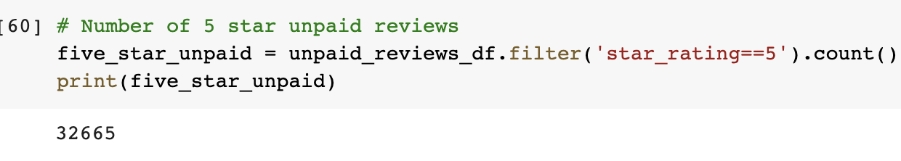
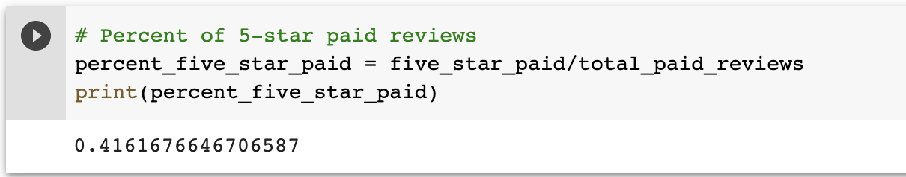
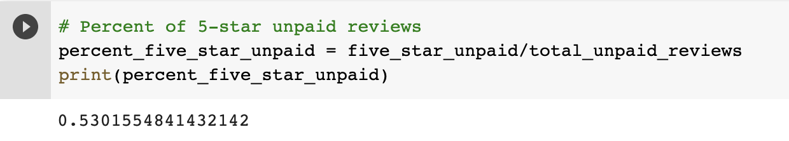

# Amazon_Vine_Analysis

## Overview
The purpose of this analysis is to determine if there is any bias toward favorable reviews on **SPORTS** from Vine members (paid reviewwers) in the sports dataset. This analysis is for SellBy stakeholders.

## Results
o	How many Vine reviews and non-Vine reviews were there?

**Total number of Vine Reviews:**

  

**Total number of Non-Vine Reviews**

 

o	How many Vine reviews were 5 stars? How many non-Vine reviews were 5 stars?
**Total number of Vine 5 Star Reviews:**

  

**Total number of Non-Vine 5 Star Reviews**

 

o	What percentage of Vine reviews were 5 stars? What percentage of non-Vine reviews were 5 stars?

**Percentage of Vine 5 Star Reviews:**

  

**Total number of Non-Vine 5 Star Reviews**

 

## Summary: 

There does not appear to be a bias for the Vine program as evidenced by the 5-star percentage between paid (42%) and unpaid (53%). 

In addition, the total count of reviews is 61,948. Of these reviews, 99.5% of them are from non-Vine reviewers. This ovewhelming majority of non-paid reviewers removes any hint of bias towards the overall assessment.
